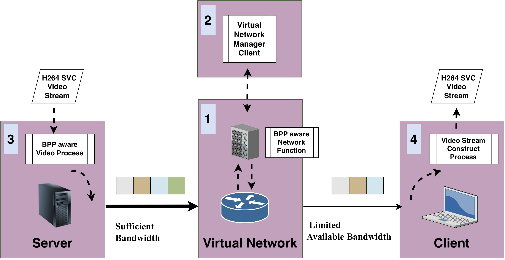
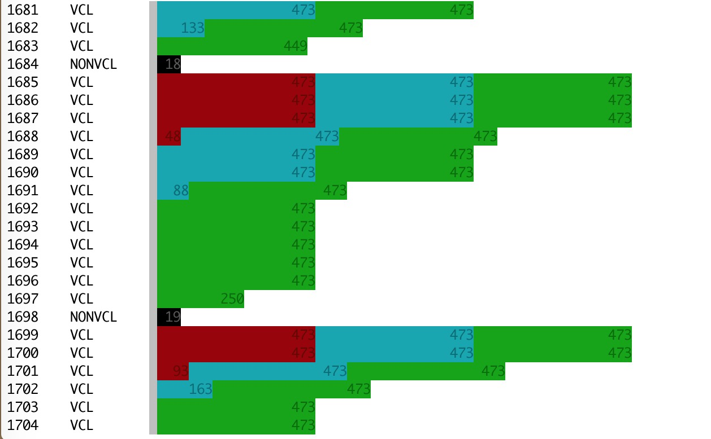

## H264 over BPP via VLSP

This describes sending H264 video files with BPP, via a VLSP Virtual
Network.


### Required Software

a.  **[H264 over BPP]**  The H264 over BPP sender and receiver software:  
    https://github.com/stuartclayman/h264_over_bpp
    
b.  **[VLSP]** The VLSP -- the Very Lightweight Network & Service platform:  
    https://github.com/stuartclayman/VLSP

c. **[VLSP clients]**  The VLSP clients:  https://gitlab.com/sclayman/vlsp-client


### Setup

The setup has 4 terminals

1.  one running VLSP
2.  one with a VLSP client, sending commands to VLSP
3.  a BPP sender
4.  a BPP receiver

The following figure shows how these interact.



### Virtual Network

For this evaluation, the virtual network is setup as 3 nodes and 2 virtual links.
There is an _ingress_ fn,  on node 1, that accepts UDP packets, and an _egress_ fn, on node 3, that forwards UDP packets.

On node 2, the BPP Network Function runs.  It takes packets and removes chunks if the bandwidth is too low.  In this case, the bandwidth is *not* calculated dynamically, but passed in as an argument.  To change the bandwidth, the BPP Net Fn is stopped, and a new one started with a different bandwidth arg.


## Terminal 1 - VLSP

Requires: **[VLSP]** 

If VLSP is not built yet, you can run `ant build` to compile it.  Then it is ready to run.

On this terminal run these commands:

Setup the CLASSPATH  
`$ export CLASSPATH=.:libs/*` 

Run VLSP  
`$ java usr.vim.Vim scripts/control-wait.xml`

This starts the Virtual Infrastructure Manager, using the config file in `scripts/control-wait.xml`.

This platform will produce a lot of output as it starts up.  The last few lines looks similar to this:

```
LeastUsedLoadBalancer: localcontrollers = [localhost:10000]  
192.168.7.104:8888 GC: Setup PlacementEngine: null  
EventScheduler: Adding Event at time: 0 Event StartSimulation: 0  
EventScheduler: Adding Event at time: 50065408 Event EndSimulation 50065408  
EventScheduler: 00:00:00  starting event StartSimulation: 0  
192.168.7.104:8888 GC: Start of simulation  at: 0 1643992328463  
192.168.7.104:8888 GC:  {"msg":"Simulation started","success":true}  
EventScheduler: 00:00:01  finishing event StartSimulation: 0  
EVENT: <0> 11 @ 1643992328464 waiting 50065397  
```

VLSP is now ready and waiting for commands.


## Terminal 2 - VLSP Client

Requires **[VLSP clients]** 

On this terminal the VLSP client is run.  It sends commands to VLSP to set it up and configure it ready for the H264 over BPP transmission.

To run the python client:  
`$ python3`

Load the relevant definitions:  
`>>> from bpp_netfn import *`

Setup the VimClient object:  
`>>> vc=VimClient()`  
_Returns:_ http://localhost:8888`

Setup the virtual topology:  
`>>> topology123(vc)`  
_Returns:_ {'routers': [{'address': '1', 'mgmtPort': 11001, 'msg': 'Created router 1   ', 'name': 'Router-1', 'op_time': 1242, 'r2rPort': 11002, 'routerID': 1, 'success': True}, {'address': '2', 'mgmtPort': 11003, 'msg': 'Created router 2   ', 'name': 'Router-2', 'op_time': 1206, 'r2rPort': 11004, 'routerID': 2, 'success': True}, {'address': '3', 'mgmtPort': 11005, 'msg': 'Created router 3   ', 'name': 'Router-3', 'op_time': 1194, 'r2rPort': 11006, 'routerID': 3, 'success': True}], 'links': [{'linkID': 196612, 'linkName': 'Router-1.Connection-0', 'msg': 'link started 1 2 ', 'op_time': 416, 'router1': 1, 'router2': 2, 'success': True, 'weight': 1}, {'linkID': 524297, 'linkName': 'Router-2.Connection-0', 'msg': 'link started 2 3 ', 'op_time': 160, 'router1': 2, 'router2': 3, 'success': True, 'weight': 1}]}

Start the egress and ingress functions:  
`>>> ingress_and_egress(vc)`  
_Returns:_  [{'aid': 1, 'id': 131073, 'msg': 'Started Application on router  1 demo_usr.paths.Ingress Args: 6799 3:4567', 'name': '/Router-1/App/demo_usr.paths.Ingress/1', 'op_time': 30, 'routerID': 1, 'success': True}, {'aid': 1, 'id': 393217, 'msg': 'Started Application on router  3 demo_usr.paths.Egress Args: 4567 localhost:6798', 'name': '/Router-3/App/demo_usr.paths.Egress/1', 'op_time': 17, 'routerID': 3, 'success': True}]

Start the BPP Net Fn, with a bandwidth of 0.9 Mbps:  
`>>> bpp_node(vc, 0.9)`  
_Returns:_ {'aid': 1, 'id': 262145, 'msg': 'Started Application on router  2 demo_usr.bpp.BPPFn Args: -b 0.9 -r 160', 'name': '/Router-2/App/demo_usr.bpp.BPPFn/1', 'op_time': 19, 'routerID': 2, 'success': True}

Stop the BPP Net Fn:  
`>>> stop_fn(vc)`  
_Returns:_ {'op_time': 9, 'success': True}


You will also see these return values on the VLSP console, as well as some other messages.


## Terminal 4 - H264 Receiver

Requires **[H264 over BPP]**  

Once the VLSP system is deployed and configured, then H264 video recievers and senders can be set up.

First, a reciever is started.

`java cc.clayman.app.H264Listen -f received.264 -p 6798`

This will listen on port '6798', the port the _egress_ sends to, and will save the recieved H264 video in `received.264`.

When video arrives, you will see output that shows info about each of the frames, such as the following:

```
...
1325     39104  4888  1281705   1286592    3 1  VCL     Slice layer without partitioning non IDR
1326     27064  3383  1286593   1289975    3 20 VCL     Coded slice extension
1327     77664  9708  1289976   1299683    3 20 VCL     Coded slice extension
1328     72     9     1299684   1299692    0 6  NONVCL  Supplemental enhancement information (SEI)
1329     72     9     1299693   1299701    2 14 NONVCL  Prefix NAL unit
1330     2976   372   1299702   1300073    2 1  VCL     Slice layer without partitioning non IDR
1331     15784  1973  1300074   1302046    2 20 VCL     Coded slice extension
1332     38288  4786  1302047   1306832    2 20 VCL     Coded slice extension
1333     80     10    1306833   1306842    0 6  NONVCL  Supplemental enhancement information (SEI)
1334     64     8     1306843   1306850    0 14 NONVCL  Prefix NAL unit
1335     1144   143   1306851   1306993    0 1  VCL     Slice layer without partitioning non IDR
1336     704    88    1306994   1307081    0 20 VCL     Coded slice extension
1337     3136   392   1307082   1307473    0 20 VCL     Coded slice extension
1338     72     9     1307474   1307482    0 6  NONVCL  Supplemental enhancement information (SEI)
...
```
## Terminal 3 - H264 Sender

Requires **[H264 over BPP]**  


After a reciever is started, then a sender can then be started:

`java cc.clayman.app.BPPSend -f video/foreman.264 -p 6799`


This will send to port '6799', the port the _ingress_ listens to. When video is read from the file, you will see output that shows info about each of the packets being sent, such as the following:





It has different colours for each of the video layers: red for layer 0 (the base layer), blue for layer 1, and green for layer 2, together with with the number of bytes for each chunk.
